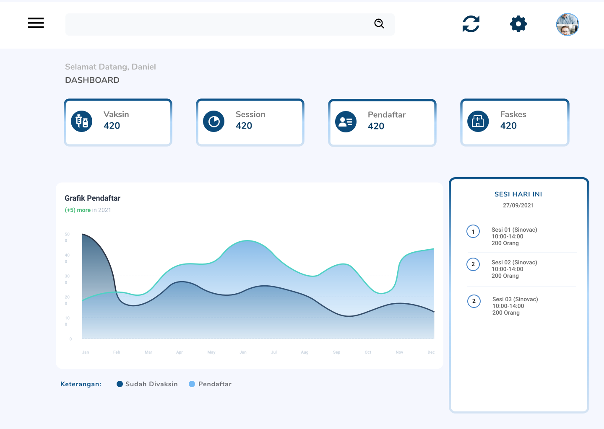

:sparkles:Alterra Project:sparkles:

<h1 align="center">RESERVAKSIN</h1>

  

<strong><a href="https://reservaksin.live">💉 Reservaksin User</a></strong>
|
<strong><a href="https://admin.reservaksin.live">🏥 Reservaksin Admin</a></strong>

## Preview
| Admin | User |
| ----------- | ----------- |
| |  |

## 🎯 Project Goal
The goal of the project is to help the government’s goal of Covid-19 vaccinations
by facilitating users to **book vaccination sessions easily** and creating a proper
system for health facilities.

## 🚩 MVP
| Admin | User |
| ----------- | ----------- |
| <ul><li>- [x] Register to the system using NIK</li>| <ul><li>- [x] Manage vaccination bookings</li> |
| <ul><li>- [x] Add their family members</li>| <ul><li>- [x] Manage sessions availability</li> |
| <ul><li>- [x] Book vaccination sessions in nearby health facilities</li>| <ul><li>- [x] Manage vaccine stocks</li> |
| <ul><li>- [x] Receive a vaccination pass to be shown in health facilities</li>| <ul><li>- [x] Vaccination Names</li> |
| <ul><li> </li>| <ul><li>- [x] View vaccination news</li> |

## 🎨 Design
* User Persona
* ERD 
* [Wireframe Figma](https://www.figma.com/file/awRtiv9eHKf0fJ0rRhKAGr/Wireframe---Mockup?node-id=6%3A8)
* [Mockup Figma](https://www.figma.com/file/awRtiv9eHKf0fJ0rRhKAGr/Wireframe---Mockup?node-id=38%3A20)
* [Prototype Figma](https://www.figma.com/proto/awRtiv9eHKf0fJ0rRhKAGr/Wireframe-Mockup?node-id=6%3A8&scaling=scale-down&page-id=6%3A8)
* Usecase Diagram 
  
## 📑 Backend Documentation
* [Swagger](https://app.swaggerhub.com/apis/diahfani/Vaccine/1.0.0)
* [Postman](https://documenter.getpostman.com/view/17541111/UVeAuUEj)

## 💻 Tecnology That We Used
* High Level Architecture

  
